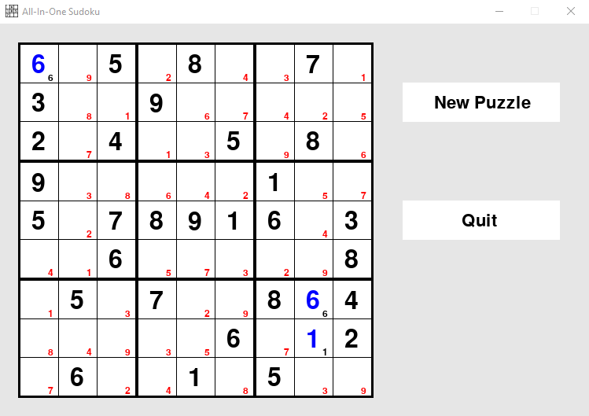
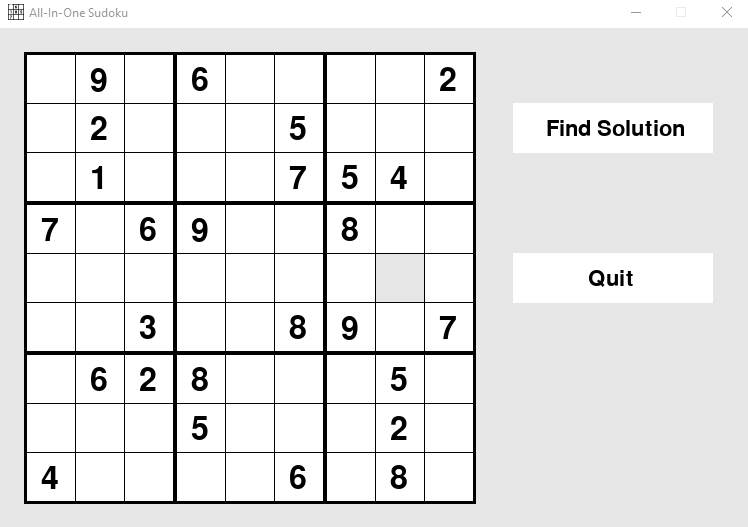

# Sudoku Game
## General Information
Using the backtracking algorithm, web scraping, and PyGame, I created a Sudoku game replicating the features of popular digital Sudoku games.

The first feature is a standard Sudoku puzzle generator with varying difficulties that a user can attempt to solve, along with accompanying solutions. The puzzles are produced through web scraping and are sourced from nine.websudoku.com. There are two versions of the web scraping code used to generate the puzzles, with the first using manual HTML parsing and the second utilizing BeautifulSoup.

The second feature provided is an automatic solver for which users can find the solution to an arbitrary puzzle.

## File Information
For the version of the project using manual HTML parsing, sudoku_main.py contains all the relevant code. The code is also split amongst the other modules, as follows:
* sudoku_backtracking.py contains all relevant code which implements the backtracking algorithm to solve an arbitrary sudoku puzzle input by the user
* sudoku_scraper.py contains all relevant code which implements web scraping to produce the random puzzles
* sudoku_pygame.py contains all relevant code used to implement PyGame to create the user interface for the game, using sudoku.png

For the second version of the project utilizing BeautifulSoup instead of manual HTML parsing, sudoku_main_bs.py contains all the relavant code and sudoku_scraper_bs.py provides the updated functionality of the web scraper, with the other modules remaining the same.

Additional dependencies include:
* time
* copy
* pyautogui
* urllib.request
* pygame
* bs4
