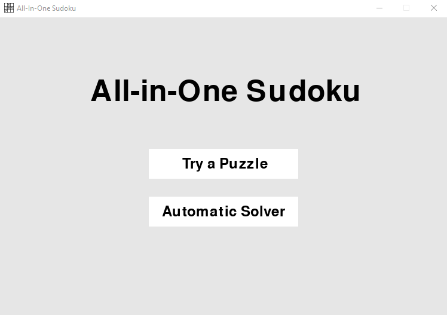

# Sudoku Game
## General Information
Using the backtracking algorithm, web scraping, and PyGame, I created a Sudoku game replicating the features of popular digital Sudoku games.

Features included is a standard Sudoku puzzle generator with varying difficulties that a user can attempt to solve, along with accompanying solutions,

and an automatic solver for which users can find the solution to an arbitrary puzzle.

All puzzles generated are sourced from nine.websudoku.com.

## File Information
sudoku_main.py contains all the relevant code for this project. This code is split between the other files, as follows:
* sudoku_backtracking.py contains all relevant code which implements the backtracking algorithm to solve an arbitrary sudoku puzzle input by the user
* sudoku_scraper.py contains all relevant code which implements web scraping to produce the random puzzles
* sudoku_pygame.py contains all relevant code used to implement PyGame to create the user interface for the game, using sudoku.png

Additional dependencies include:
* time
* copy
* pyautogui
* urllib.request
* pygame
